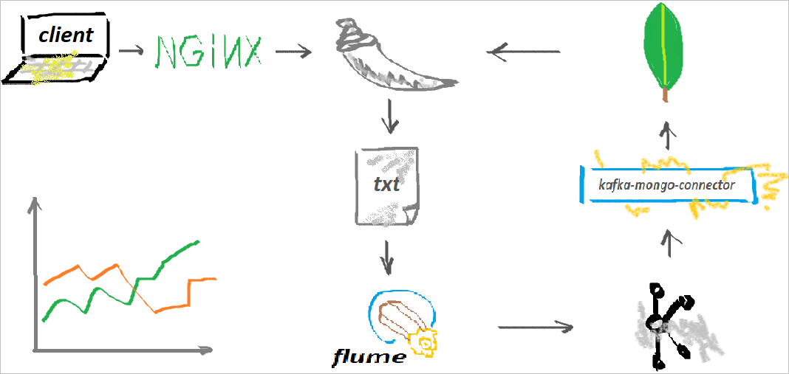

单页面`web`应用实践`flask`, `nginx`, `mongodb`, `kafka`, `flume`, `docker`。

> 需求是虚构的，技术路线并非解决方案，仅作练习

## 需求

单击鼠标模拟采集页面指定区域的`(x, y)`坐标，并分别实时显示`x`, `y`坐标的时间历程图。


## 技术路线

flask -> text file -> flume -> kafka -> mongodb -> flask




## 分解练习

每个工具的学习和演练参考[练习文档](doc/readme.md)。

## 部署

```bash
$ docker-compose up -d
```

## 提高方向

- [ ] 配置文件之间配置项的自动同步， *例如`kafka`主题名同时在`flume`、`kafka_mongo_connector`配置文件，及`docker-compose`出现*。

- [ ] 练习集群方式部署项目


